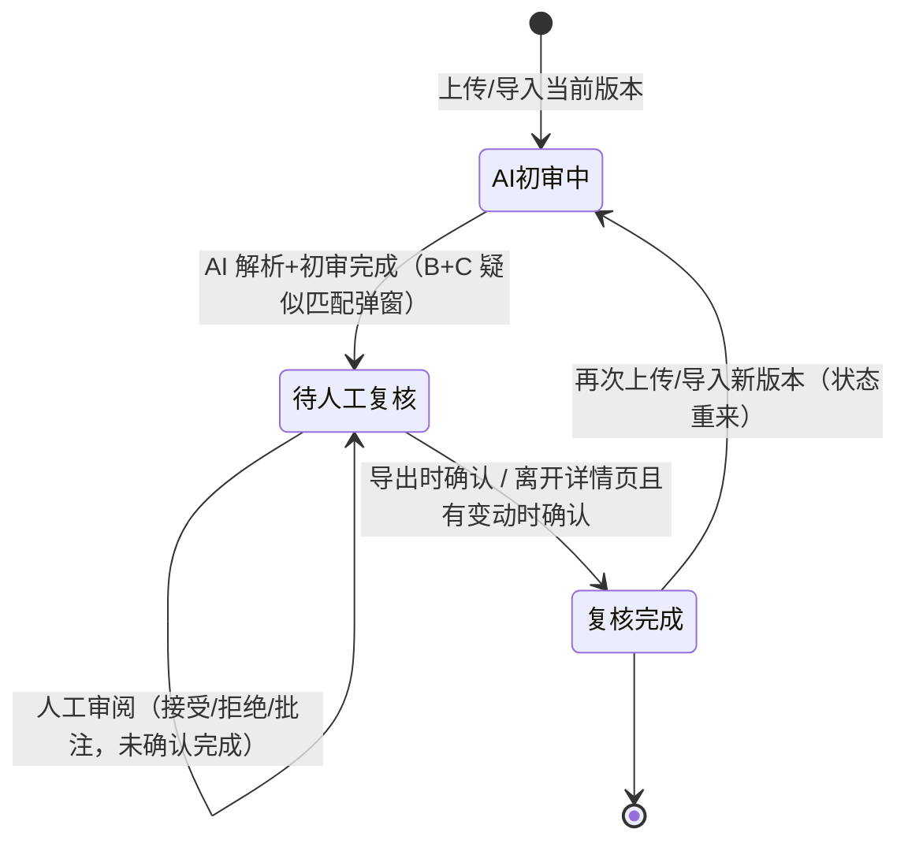

# 明衡 · 合同审核 AI 产品需求文档（PRD-v1）

> 系统名称：**明衡**（合同审核 AI 初审工具）。

| 项    | 内容                                                                                                |
| ---- | ------------------------------------------------------------------------------------------------- |
| 版本   | v1（首版，基于 2026-06-26 法务面谈）                                                                         |
| 课题节点 | 下周二早上 demo 评审；约 7 号课题答辩                                                                           |
| 来源   | `analysis/20260626-李颖莹-面聊_需求摘要.md`、`analysis/20260626-李颖莹-面聊_说话人分离.md`、`raw/20260626-李颖莹-微信聊天.md` |
| UI 风格 | 以「合同审阅工作台」原型为基准，详见 `docs/02-技术方案/UI风格参考.md`（藏青 + 点缀金 + 纸白的中式法务风） |

---

## 一、产品背景与目标

### 1.1 背景

公司要做"合同优化"方向的 AI 产品，方总将其临时纳入本批次课题。AI 团队此前与法务沟通过需求，但因**合同属公司机密、老板要求核心数据自主可控**，产品一直搁置未推进。本次面谈正式启动该产品。

> 来源：`analysis/20260626-李颖莹-面聊_需求摘要.md#一、背景与参与人`、`#五、数据敏感性与样例数据方案`

### 1.2 现状流程与痛点

现有流程：商务拿合同 → 法务对接审核 → 法务给反馈意见 → 商务再跟客户对接 → 反复。合同很长、审核耗时长、标的量大。

法务（微信先发）列出的四类痛点：

1. 审查效率低、重复性工作多、交付周期长；
2. 模板比对繁琐（需人工开 WPS 比较功能）；
3. 审查标准不统一（依赖个人经验，不同法务侧重不同）；
4. 风险条款容易遗漏（尤其长合同、非标准条款）。

> 来源：`raw/20260626-李颖莹-微信聊天.md#14:24`、`analysis/20260626-李颖莹-面聊_需求摘要.md#二、业务现状与核心痛点`

### 1.3 产品目标

为法务提供一个**部署在公司办公网内、数据自主可控**的合同审核 AI **初审**工具：上传合同后自动完成风险条款识别、修改建议（带法律依据）、文档/版本篡改比对、修改留痕一键应用，并支持甲/乙/中立三角色视角切换，把所有合同先拉到"60 分基础线"，法务在此基础上复审。

> 关键定位：AI 做**初审**，法务**必须复审**，不能直接采信（模型审核能力不确定、存在幻觉、不同客户对条款接受度不同）。
> 来源：`analysis/20260626-李颖莹-面聊_需求摘要.md#三、产品形态与核心功能`、`#八、一句话总结`

### 1.4 衡量指标（参考）

- 初审"风险识别 + 修改建议"达成业务认可的"成功标准"：以**初审把合同拉到 60–80 分基础线**为验收口径——即在法务复审前，AI 初审对一份采购合同中**主要风险条款的识别覆盖率达到约 60%–80%**，且每条识别均附可用的修改建议。其上限（80 分以上）由法务个人经验在复审阶段补足。
- 模板比对替代人工开 WPS 比对，重复性工作时间显著下降。

> 来源：`analysis/...需求摘要.md#功能一`、`#功能二`

---

## 二、用户角色与使用场景

| 角色       | 说明          | 在产品中的动作                         |
| -------- | ----------- | ------------------------------- |
| 法务（核心用户） | 合同审核责任人     | 上传合同、选择立场角色、查看初审结果、复审、应用修改、查看留痕 |
| 商务（间接）   | 提供合同来源      | （二期）联动反馈客户意见                    |
| 业务/规则维护者 | 定义审查标准与风险规则 | （后续）维护规则库、法律知识库                 |

**核心使用场景（用户故事）**

- 作为**法务**，我想上传一份合同后自动得到标黄的风险条款和修改建议，以便我只需在初审基础上复审，而不必逐行通读整篇长合同。
- 作为**法务**，我想上传对方改过的合同后自动列出相对基准（我方标准合同或上一版本）的所有变更，以便我不必再人工打开 WPS 比较功能逐处核对。
- 作为**法务**，我想切换甲方/乙方/中立方角色，以便 AI 给出的风险点和修改建议匹配我方立场。
- 作为**法务**，我想对每条修改有留痕并能一键应用进原文，以便修改可追溯且无需手工复制粘贴。

> 来源：`analysis/...需求摘要.md#三、产品形态`、`#四、关键产品特性`

---

## 三、需求清单（按优先级）

> 优先级：**P0 = MVP 必做**；**P1 = 第二批**；**P2 = 可延后**。

| 编号  | 需求                        | 优先级    | 来源                            |
| --- | ------------------------- | ------ | ----------------------------- |
| F1  | 合同上传与在线查看（采购合同优先）         | P0     | 摘要#功能一、转写[01:18~01:29]        |
| F2  | 风险条款初审 + 修改建议（标黄/批注/解决方案） | P0     | 摘要#功能一、转写[01:00~01:11][03:29] |
| F3  | 文档/版本比对（篡改检测，自动列出新增/删除/修改） | P0     | 摘要#功能二、转写[09:41~11:01]        |
| F4  | 甲/乙/中立三角色模式切换             | P0     | 摘要#功能特性、转写[20:05~21:38]       |
| F5  | 修改留痕 + 一键应用进原文            | P0     | 摘要#修改留痕、转写[21:38~22:24]       |
| F6  | 修改建议附法律依据引用（民法典等）         | P0     | 摘要#修改留痕、转写[21:38~21:57]       |
| F7  | 法律知识库（民法典、数据安全法、个人信息保护法）  | P0     | 摘要#法律知识库、转写[22:44~23:17]      |
| F8  | 审查标准统一（60 分基础线）+ 规则库      | P1     | 摘要#功能三、转写[11:44~13:31]        |
| F9  | 风险条款防遗漏（语义分析，一键定位不平等条款）   | P1（保底） | 摘要#功能四、转写[15:25~16:37]        |
| F10 | 复用吴志刚已沉淀的审核规则（数据/规则来源）    | P1     | 摘要#关键线索、转写[13:31~14:59]       |
| F11 | 模板固化 + 字段级编辑权限 + 版本/修改记录  | P1     | 转写[09:10~09:40]               |
| F12 | 商务联动：客户反馈回填后自动改条款         | P2（二期） | 摘要#边界、转写[03:06~03:16][17:07]  |
| F13 | 多合同类型扩展（开发者/云生等专用规则）      | P2     | 转写[18:28~18:54]               |
| F14 | 按岗位/关注点快速定位到相关条款（免翻整篇）    | P1     | 转写[08:28~08:48]               |
| F15 | 模型可配置：自定义 API Key + 多供应商（DeepSeek/GLM/GPT/中转站） | P0     | 需求方补充（2026-06-27）            |
| F16 | 登录 + 登录后选岗位（销售/法务/商务/财务，可记住）   | P0     | 需求方补充（2026-06-27）            |
| F17 | 合同类型识别（仅采购合同；不支持则提示并列出支持类型） | P0     | 需求方补充（2026-06-27）            |
| F18 | 合同列表（合同库 / 首页）：已上传合同的留存、检索与再进入 | P0     | 需求方补充（2026-06-27）            |
| F19 | 审计日志（独立菜单）：记录谁/何时/做了什么，合规留痕 | P0     | 需求方补充（2026-06-27）            |

---

## 四、P0 功能详述与验收标准

### F1 合同上传与在线查看

- 在工作台/个支中以"合同审核"应用入口呈现：点进去 → 上传合同 → 在线查看。
- MVP 先支持采购合同；**MVP 文件格式仅支持 Word（.doc/.docx）与 PDF（.pdf）**，其余格式（图片、扫描件、WPS 专有格式等）后续按需扩展（对应微信补充诉求"支持多种文件形式上传比对"）。
- **上传时归属选择（关联同一份合同 · 方式 A，必做）**：上传时选择"**新合同**"或"**某已有合同的新版本**"（用于 F3 版本比对）。
- **初审后疑似匹配提醒（方式 B+C）**：初审结束后，系统**复用已解析的内容**，按**合同编号 + 内容相似度（甲乙方/标的/条款）**检测是否与库内已有合同高度相似，**弹窗提醒**"疑似为《XX v?》的新版本，是否关联？"，由用户确认（见 9.2-5）。
- **上传人**：记录上传/录入人（建议为销售），仅作溯源，不参与流程判断。

**验收（Given-When-Then）**

- Given 法务进入"合同审核"应用，When 上传一份 Word 或 PDF 格式的采购合同文件，Then 系统成功解析并在线展示合同正文。
- Given 法务上传非 Word/PDF 格式文件，When 触发上传，Then 系统给出明确的"暂不支持该格式"提示。
  > 来源：`raw/...微信聊天.md#16:33`、转写[01:18~01:34]

### F2 风险条款初审 + 修改建议

- AI 找出合同中的风险条款，对关键条款**标黄 + 批注**，并给出**条款修改建议**与解决方案。
- 明确定位为**初审**：结果供法务复审，不直接采信。
- 需正视的模型约束：审核覆盖度不确定、存在幻觉、不同客户对条款接受度不同（需人工沟通确认）。

**验收**

- Given 一份已上传的采购合同，When 触发初审，Then 系统标黄风险条款、给出每条的批注说明与修改建议。
- Given 初审结果，When 法务查看，Then 每条风险有明确的条款定位（可跳转/定位到原文位置）。
  > 来源：转写[01:00~~01:11][03:29~~03:36]、摘要#功能一

### F3 文档/版本比对（篡改检测）

> 概念澄清：法务口中的"模板"指**我方那份标准采购合同文件**，作为比对的**基准参照物**，并非"带占位符变量、可填充的模板引擎"。本功能的本质是**两份文档对齐做 diff**（法务/产品方在面谈中也将其总结为"版本比对、数据比对"），列出新增/删除/修改。**MVP 不引入"模板管理系统"作为前提**；把我方模板"固化进系统 + 锁条款/字段权限"属增强项，见 F11（P1）。

- 现状：法务手动用 WPS 比较功能，上传"我方那份标准合同"+"对方改过的合同"看改动。
- 期望：上传后**自动列出所有变更**（新增/删除/修改）并可定位原文，无需人工开 WPS。
- **比对基准**可来自二者之一：
  - **我方标准合同文件**（对方在我方版本上改动 → 检测篡改）；
  - **该合同的上一版本**（如"销售提交 v1 → 法务/对方 v2"的版本比对，见 UI 原型）。
- MVP 实现上：直接拿"另一份上传文件 / 选定的上一版本"作基准即可，不依赖"模板固化"。

**验收**

- Given 一份基准合同（我方标准合同或上一版本）与一份待审合同，When 触发比对，Then 系统自动列出全部变更项（新增/删除/修改）并可定位到原文。
- Given 比对结果，When 法务查看，Then 无需任何人工 WPS 操作即可完成变更核对。
  > 来源：转写[09:41~11:01]（含说话人A"就是一个版本比对、数据比对"的总结）、摘要#功能二

### F4 甲/乙/中立三角色模式切换

- 合同有甲乙双方，立场不同关注的风险相反：
  - 甲方（采购方）：强势，要求按期交货、逾期违约责任越大越好；
  - 乙方：防守，希望违约责任越小越好；
  - 中立方：公平（如母子公司之间签约），不偏向任何一方。
- 切换角色后，AI 输出的风险点与修改建议随之变化。
- **默认角色：甲方（采购方，公司本批次以对外采购为主场景）**；登录后由用户选择立场，可"记住"为默认（见 F16）。**切换粒度：MVP 以整篇为单位切换**（整篇按同一立场重新初审），单条款级别的角色切换后续再评估。
- **复审开始后锁定立场**：当前版本一旦产生复审留痕（接受/拒绝/批注，或已将 AI 建议一键应用进正文），则禁止再切换甲/乙/中立立场，直至该版本全部留痕被撤销或进入新版本。避免「已应用正文 / 已表态条款」与切换立场后重新生成的 AI 建议不一致。

**验收**

- Given 一份合同的初审场景，When 法务在甲方/乙方/中立方之间切换角色，Then 整篇风险点与修改建议相应改变并体现该立场倾向。
- Given 进入初审，When 未手动切换角色，Then 默认以甲方立场输出。
- Given 当前版本已有复审留痕（接受/拒绝/批注或已应用修改），When 法务尝试切换立场，Then 立场切换控件禁用并提示「立场已锁定」；撤销全部留痕后恢复可切换。
  > 关联：切换角色后还应支持快速定位到该立场关注的条款（见 F14）。
  > 注：立场是**个人审阅视角**，只影响 AI 风险解读倾向，**不改变共享的合同内容**（见 F18 协作前提）。
  > 来源：转写[20:05~21:38]、摘要#甲乙中立三角色

### F5 修改留痕 + 一键应用

- 所有 AI 修改必须有可追溯**痕迹**（修改记录列表/版本）。
- 建议条款支持**一键应用**进原文，免人工复制粘贴。

**验收**

- Given 一条 AI 修改建议，When 法务点击"应用"，Then 该建议直接写入原文对应位置，无需手工复制粘贴。
- Given 任一次修改，When 法务查看修改记录，Then 可看到修改前后内容与来源（AI/人工）的留痕。
  > 来源：转写[21:38~~22:24][09:29~~09:40]、摘要#修改留痕

### F6 修改建议附法律依据

- 修改建议可引用对应法律条文（如"根据《民法典》第 X 条"）作为依据。

**验收**

- Given 一条涉及法律的修改建议，When 法务查看，Then 显示对应的法律依据引用。
  > 来源：转写[21:38~21:57]、摘要#修改留痕

### F7 法律知识库

- MVP 范围：**民法典、数据安全法、个人信息保护法**。
- **条文来源与更新机制**：MVP 阶段**先静态导入**上述三部法律的关键条文（人工整理/导入为结构化条目，随版本发布更新），暂不做自动抓取或在线同步；后续再评估定期人工维护或对接权威法规数据源的更新机制。
- 先做通用基础版，后续按合同类型扩充法律依据库。

**验收**

- Given 初审与建议生成，When 涉及上述三部法律，Then 系统能基于静态导入的知识库给出依据。
- Given 知识库，When 后续新增合同类型或条文更新，Then 支持以静态导入方式扩充/更新对应法律条目（设计上预留）。
  > 来源：转写[22:44~23:17]、摘要#法律知识库

### F15 模型可配置（自定义 API Key + 多供应商）

- 平台需提供**模型配置能力**：可在管理界面自定义模型供应商的 **API Key、Base URL（接口地址）、模型名**等参数，便于在不同环境/供应商间切换，不写死单一模型。
- **生产与默认形态：使用公司本地已私有化部署的 DeepSeek 开源模型**（自建推理服务，数据不出内网，满足"核心数据自主可控"硬约束，见 6.2）。这是数据安全前提下的首选链路。
- **测试形态**：测试阶段同样以 DeepSeek 为主（可走本地服务或 DeepSeek 在线 API），用于功能联调与效果验证。
- **需兼容的供应商（OpenAI 接口规范优先）**：
  - **DeepSeek**（本地私有化 / 官方 API）——默认；
  - **GLM**（智谱）；
  - **GPT**（OpenAI）；
  - **中转站**（OpenAI 兼容的第三方中转/relay 端点，自定义 Base URL + Key）。
- 设计要求：统一走 **OpenAI 兼容协议**抽象，新增供应商只配不改码；Key 等敏感配置需加密存储、不明文回显。

**验收**

- Given 管理员进入模型配置，When 填写某供应商的 Base URL / API Key / 模型名并保存，Then 系统使用该配置完成一次初审调用并返回结果。
- Given 已配置多个供应商，When 切换当前启用的模型，Then 后续初审请求走新模型，无需改动代码或重启（或仅热加载）。
- Given 默认部署，When 未配置任何外部供应商，Then 系统默认调用本地 DeepSeek 模型且请求不出内网。
- Given 涉敏感合同的生产链路，When 选择模型，Then 仅允许本地 DeepSeek（外部 API 默认禁用或需显式审批，见 6.2）。
  > 来源：需求方补充（2026-06-27）——本地已部署 DeepSeek 开源模型，测试/生产均以 DeepSeek 为主，并支持 GLM/GPT/中转站可配置接入。

> 实现说明：模型网关优先用**轻量开源（LiteLLM Proxy）或应用内适配层**；若内网已有 New API/One API 则可复用，不为本项目专门新搭重平台。详见技术方案 §三。

### F16 登录 + 登录后选岗位（可记住）

> 重要区分（两个不同的"角色"，勿混）：
> - **岗位角色**（本需求 F16）：用户的**职能身份**——销售 / 法务 / 商务 / 财务。决定流转身份，以及进入合同后**定位到本岗位关注的条款段落**（见 F14）。法务原话："商务人员只要填商务信息…财务看一下财务条款、结算条款…法务看信息有没有填对…根据使用者的角色来去定位到那个段落"（转写[08:28~08:48]）。
> - **立场角色**（F4）：谈判**立场**——甲方 / 乙方 / 中立方。只影响 AI 风险解读倾向，在工作台内切换，**与岗位是两件事**。

- 系统需**登录**后使用（内网应用）。
- 登录进入后**立即让用户选择岗位**（销售 / 法务 / 商务 / 财务，核心用户法务为默认）。
- 选择处提供「**记住，下次不再选择**」勾选项：勾选后记住岗位，**下次登录直接进入、跳过选择**。
- 进入合同后，系统按**岗位**自动定位/高亮该岗位关注的条款段落（见 F14），免翻整篇。
- 立场（甲/乙/中立）不在此选择，由工作台顶栏切换，默认甲方（见 F4）。
- （说明：正式系统中岗位通常来自账号属性，本期允许登录时选择并记住，便于演示与多岗位试用。）
- **用户体系（自建 · 账号分配制）**：平台**并非全员自助登录**，而是**自建用户体系 + 账号分配制**——由管理员开通/分配账号（账号/密码、岗位、角色：法务/管理员/维护者），无自助注册。仅支撑登录、岗位、模型配置等管理权限；**认证层做成可插拔**，后续可替换/对接公司统一账户体系（SSO/LDAP，见待确认 9.1-4），不返工。

**验收**

- Given 未登录，When 访问应用，Then 跳转登录；登录成功后进入。
- Given 首次登录（未记住偏好），When 进入，Then 弹出岗位选择（默认法务）。
- Given 选择岗位时勾选"记住"，When 下次登录，Then 跳过选择、直接以记住的岗位进入。
- Given 已选定岗位，When 打开某合同，Then 自动定位到该岗位关注的条款（如财务→付款/违约金；销售→交货）。
  > 来源：需求方补充（2026-06-27）；岗位定位呼应转写[08:28~08:48]。

### F17 合同类型识别（MVP 仅采购合同）

- 上传合同后系统**自动识别合同类型**。MVP 仅支持**采购合同**。
- 分支：
  - 识别为**采购合同** → 标注「已识别为：采购合同」并继续审核流程；
  - **无法识别 / 识别为暂不支持的类型** → **提示"暂无法识别合同类型 / 暂不支持该类型"**，并展示**当前支持的合同类型列表**（目前仅：采购合同）；
  - 允许用户**手动确认/纠正**（如手动选择"按采购合同处理"），避免误判卡死。
- 设计上为多合同类型扩展（F13）预留：每种类型对应各自的抽取字段/规则/法条。

**验收**

- Given 上传一份采购合同，When 解析完成，Then 系统识别为"采购合同"并进入审核。
- Given 上传非采购合同（或无法识别），When 解析完成，Then 提示不支持，并列出当前支持的合同类型（采购合同）。
- Given 识别结果有误，When 用户手动指定类型，Then 按用户确认的类型继续。
  > 来源：需求方补充（2026-06-27）。

### F18 合同列表（合同库 / 首页）

> 背景：原需求是单合同流（上传→审→出结果），未定义"已上传合同存哪、如何再找回"。F18 补足这一入口：合同上传后持久化留存，**首页以列表呈现**，可检索、再进入审阅。

- **合同库为团队共享（协作前提）**：合同库不是个人私有列表，而是**团队共享、单一数据源**——同一份合同**所有协作者看到的内容一致**（相同的版本、变更、初审结果、修改留痕），以支撑销售→法务→商务的流转协作。
- **登录后默认进入合同列表（首页）**，而非直接上传。列表展示已上传合同：合同名称、编号、**合同类型**、**状态**、当前版本、最近更新时间、**上传人/录入人**（仅溯源记录，建议为销售，见待确认）。
- **版本状态（跟着版本走，列表展示当前版本状态）**：状态挂在**当前版本**上，列表「状态」列即当前 `ver` 的状态；再次上传/导入新版本时**状态从头来过**。
  - **AI初审中**：已上传当前版本，AI 正在解析/初审；
  - **待人工复核**：AI 解析与初审完成，等待人工复核（接受/拒绝/批注）；
  - **复核完成**：人工确认本版本复核完成。
- **复核完成确认（两个触发点）**：
  - **导出**：在「待人工复核」状态下导出 Word/PDF/变更报告时，询问是否复核完成；选「复核完成」则当前版本状态变为「复核完成」；
  - **离开详情页**：在「待人工复核」且本版本有审阅变动（接受/拒绝/批注）时，离开工作台前询问是否复核完成。
- **再次导入/上传新版本** → 新版本状态从 **AI初审中** 重新开始（不复用上一版本状态）。
- **内容共享 vs 立场视角**：合同正文/版本/变更/留痕是**共享一致**的客观数据；**立场角色（甲/乙/中立）只是个人审阅视角**，仅改变 AI 风险解读倾向，**不改变合同内容本身**，因此不影响其他协作者看到的内容（见 F4/F16）。
- （权限粒度——谁可见/谁可改哪些合同与条款，见待确认问题；MVP 先按"团队内共享可见"，字段级编辑权限随 F11）。
- 列表页提供**「上传合同」入口**（走 F17 识别流程；上传时可选「新合同」或「某已有合同的新版本」，见 F1）；上传成功后该合同**出现在列表**并可进入工作台。
- 支持**检索/筛选**（按名称/编号、类型、状态）。
- 点击某条 → 进入该合同的审阅工作台（带其版本、比对、初审、留痕）。
- （P1 可选）删除/归档、按状态分组、分页。

**验收**

- Given 已登录，When 进入系统，Then 默认看到合同列表（含已上传合同的名称/类型/状态/更新时间）。
- Given 合同列表，When 点击某合同，Then 进入其审阅工作台。
- Given 合同列表，When 点击"上传合同"并成功上传采购合同（选「新合同」），Then 新合同出现在列表中。
- Given 列表较多，When 按名称/类型/状态检索，Then 列表按条件过滤。
- Given 同一份合同，When 不同协作者分别打开，Then 看到的版本/变更/留痕内容一致（单一数据源）。
- Given 甲方用户与乙方用户分别打开同一合同，When 各自查看，Then 合同正文一致，仅 AI 解读倾向因立场不同（内容不变）。
  > 来源：需求方补充（2026-06-27）。

#### F18-1 版本状态流转

> **状态跟着版本走**：`contract_version.status` 为权威来源；列表展示的「状态」= 当前版本的状态。上传新版本 → 新版本独立状态机，从 AI初审中 重来。

**状态流转表**

| 起始 | 触发动作 | 操作人/系统 | 目标 |
|---|---|---|---|
| — | 上传/导入版本 | 销售等 | AI初审中 |
| AI初审中 | AI 解析+初审完成 | 系统/AI | 待人工复核 |
| 待人工复核 | 审阅中（接受/拒绝/批注） | 法务等 | 待人工复核（不变） |
| 待人工复核 | 导出文件并确认复核完成 | 人工 | 复核完成 |
| 待人工复核 | 离开详情页且有审阅变动，确认完成 | 人工 | 复核完成 |
| 复核完成 | 再次上传/导入新版本 | 销售等 | AI初审中（新版本，状态重来） |

> 说明：岗位流转（销售/法务/商务，`current_stage`）与版本状态正交；旧版「已退回/已定稿」等状态已收敛进上述三态 + 版本重来机制。

---

### F19 审计日志（独立菜单）

> 背景：合同属机密、可能含个人信息（涉数据安全法/个人信息保护法），需对关键操作**全量留痕、可追溯**。F19 把审计做成**独立菜单**，便于管理员/合规查阅。

- **核心字段**：**谁（用户+岗位）/ 什么时间 / 做了什么（动作）/ 对什么对象（合同+版本+条款，若有）/ 来源 IP**。
- **记录范围（关键事件）**：登录/登出、上传合同、AI 初审、查看合同、接受/拒绝/批注、退回、定稿、下载/导出、修改模型配置、用户/权限变更等。
- **只读、不可篡改**：审计记录仅追加（append-only），不提供编辑/删除入口；MVP 在应用层保证只追加。
- **查阅**：独立菜单页，按用户/动作/对象/时间检索；（P1）按时间范围筛选、导出。
- **可见范围**：默认仅**管理员**可见（与合规/安全口径一致，见 8.1）。
- 与 F15 的**模型调用日志**互补：F19 记录"人对业务的操作"，模型调用日志记录"每次 AI 调用的模型/耗时/用量"。

**验收**

- Given 法务接受了一条修改，When 打开审计日志，Then 能看到"该法务 / 时间 / 接受修改 / 对应合同条款"的记录。
- Given 销售上传了合同，When 查审计，Then 有"上传合同"记录（用户/时间/对象）。
- Given 普通岗位用户，When 访问审计菜单，Then 无权查看（仅管理员可见）。
- Given 任一审计记录，When 尝试修改/删除，Then 无此入口（只读追加）。
  > 来源：需求方补充（2026-06-27）。

---

## 五、P1 / P2 需求要点（简述）

- **F8 审查标准统一（P1）**：不同法务侧重不同，期望初审提供统一标准，保证合同先到"60 分基础线"，个人能力再加分到 80 分。实现路径：先建立规则集，AI 基于规则评判是否符合。
- **F9 风险条款防遗漏（P1·保底）**：定义风险条款规则，做语义分析，一键定位不平等条款。明确"不是当前痛点，但是保底功能，重大风险不能漏"。
- **F10 复用吴志刚规则（P1）**：吴志刚（财务账目/报告流程）此前拿过一批合同、搭建了经公司认可的审核规则提取方案。法务不便直接给合同，但吴志刚可把"提取的规则"告知 AI 团队。拿不到则先用网上通用规则自定义。
- **F11 模板固化 + 权限 + 版本（P1）**：把我方标准合同"固化"进系统（无需每次再上传基准），并限制只能改特定条款（字段级权限），配合修改记录/版本留痕。这是 F3 比对的**增强**——MVP 的比对不依赖它（直接用另一份上传文件/上一版本作基准）。
- **F12 商务联动（P2·二期）**：客户反馈回来后输入系统自动改条款。
- **F13 多合同类型扩展（P2）**：采购按民法典即可；开发者业务、云生等有各自特殊场景规则，在通用版基础上扩充。
- **F14 按岗位/关注点快速定位条款（P1）**：法务原话——不同**岗位**各看各关心的部分（如财务看结算/财务条款、法务确认关键信息、商务填商务信息），"根据使用者的角色来去定位到那个段落，就不用再去看整篇合同"，现状只能"翻翻翻"逐页找。这里的"角色"指**岗位**（F16，非甲乙中立立场）。期望：进入合同后按**登录岗位**自动定位/高亮该岗位关注的条款段落，并提供快速跳转导航，免翻整篇。与 F16（岗位）、F2（风险点定位）协同。

  **机制（关键）——按"条款类型标签"匹配，不绑定具体条款号**：不同合同条款结构不同，因此**不能**配"关注第X条"。系统在解析时给每个条款打**类型标签**（价格/金额、付款/账期、违约金/赔偿、交付/验收、质保期、保密/数据、知识产权、合同效力、解除/终止、争议解决…），定位时按"岗位→关注标签"匹配，**跨合同通用**。

  **配置（两层 + AI 默认）**：
  - **管理员层**：在「系统配置 → 岗位关注点」配置每个岗位默认关注哪些标签，全员该岗位生效。
  - **AI 默认**：管理员**未配置**的岗位，由 **LLM 按合同类型自动推荐**一份默认关注点（标注"AI 默认"，管理员可一键采纳或在其上修改）。
  - **个人层**：用户在「个人 → 我的关注点」可在岗位默认基础上**增减**，仅影响本人定位/高亮；可一键恢复岗位默认。
  - 生效优先级：个人微调 > 管理员岗位配置 > AI 默认。

  MVP 实现：内置一份默认"岗位→关注标签"映射（即 AI 默认的静态兜底）+ 一键定位；管理员/个人的可配置 UI 与 LLM 动态推荐为 P1（数据结构已按"标签"预留，不返工）。

> 来源：转写[11:44~~13:31][15:25~~16:37][13:31~~14:59][09:10~~09:40][03:06~~03:16][18:28~~18:54]、摘要#四类功能与后续

---

## 六、系统边界与非功能约束

### 6.1 边界

- **输入**：商务提供的一份合同；**输出**：审核结果（风险 + 建议 + 留痕）。
- 系统**只负责到产出审核结果**；商务联动、后端回填改条款属二期优化，不在 MVP 内。
  > 来源：转写[02:58~03:16]、摘要#六、系统边界

### 6.2 数据安全（硬约束）

- 合同属公司机密，**核心数据须自主可控**；**敏感合同的生产审核链路不得将数据发往外部 AI 服务**。
- **模型部署（更新 2026-06-27）**：生产默认调用**公司本地私有化部署的 DeepSeek 开源模型**，推理在内网完成、数据不出网，满足"自主可控"。在此前提下，平台支持**自定义 API Key/Base URL 接入外部供应商（DeepSeek 官方 / GLM / GPT / 中转站）**（见 F15），但外部 API 仅用于**非敏感测试或经审批的场景**，对敏感合同默认禁用；是否启用、用哪家由配置开关控制并可审计。
- 部署形态：公司**办公网内的网页应用**。
- MVP 训练/演示数据：**先做采购合同**（公司作为甲方对外采购，敏感度相对低）；由法务提供采购合同模板，AI 团队自行 mock 数据分析；乙方合同（受客户保密）暂不提供。
  > 来源：转写[03:42~~04:11][06:01~~07:38][16:51~17:06]、摘要#五、数据敏感性；模型部署为需求方 2026-06-27 补充

### 6.3 其他约束

- AI 结果定位为初审，须有法务人工复核环节，界面应体现"建议/待人工复核"语义而非"定论"。

---

## 七、MVP 范围与交付计划

### 7.1 MVP 范围（P0）

合同列表/合同库首页（F18）、合同上传查看（F1）、风险初审+建议（F2）、文档/版本比对（F3）、三角色切换（F4）、修改留痕+一键应用（F5）、法律依据（F6）、基础法律知识库（F7）、模型可配置（F15，默认本地 DeepSeek）、登录+角色记忆（F16）、合同类型识别（F17，仅采购合同），先覆盖**采购合同**。

### 7.2 时间线

| 节点    | 事项                        |
| ----- | ------------------------- |
| 第二天   | AI 团队先给一个 demo（已承诺）       |
| 下周二早上 | demo 评审（周一法务有验收会，仅周二早上有空） |
| 下周三   | 再对一次需求                    |
| 约 7 号 | 课题答辩（看完成度，不要求全做完）         |

> 来源：转写[01:46][07:50~~08:05][19:14~~19:41][23:35~23:44]、摘要#六、MVP 计划

---

## 八、后续行动清单

1. 法务发**采购合同模板**给 AI 团队（已商定）。
2. 持续在已建微信群沟通。
3. AI 团队联系**吴志刚**，获取已提取的审核规则（重要加速点）。
4. AI 团队按本 PRD P0 功能先出一版 demo，下周二早上评审。
5. 基于民法典/数据安全法/个人信息保护法搭基础法律库，后续扩充。

> 来源：`analysis/20260626-李颖莹-面聊_需求摘要.md#七、后续行动清单`

---

## 九、待确认问题（下周三复核）

### 9.1 待确认

1. "审查标准/规则"的最终来源与维护方：吴志刚规则能否拿到？拿不到时自定义规则的验收口径？
2. 合同库的**权限粒度**：是否需要按角色/部门限制可见与可改范围（如商务只看相关合同），还是 MVP 先"团队内全部共享可见"即可？字段级编辑权限随 F11 一并定。
3. **合同由谁上传/录入**：倾向**由销售上传**（销售最先拿到合同）。列表中的人列语义为**"上传人/录入人"**（仅作溯源记录，不关心、不参与流程判断），而非"负责人"。待与法务确认上传责任归属。
4. **接入公司账户体系**：后续将对接公司统一账户/认证（SSO/LDAP 等）。MVP 先做**自建用户体系 + 账号分配制**（管理员开通账号，非全员自助），认证层做成**可插拔**，待确认对接方式与时间。
5. **合同存储的合规与加密强度**：合同属机密、可能含个人信息（涉数据安全法/个人信息保护法）。**建议默认落**：TLS 传输、静态加密（磁盘/卷加密或 DB TDE + 文件存储加密）、严格 RBAC 最小权限、全量访问/下载审计、密钥用 KMS/环境变量。**待确认强度**：是否需字段级加密、下载水印/防外传、备份加密、留存与销毁期限等（取决于公司安全/合规要求）。

### 9.2 已确认（2026-06-27）

1. ~~支持上传的具体文件格式范围~~ → **MVP 仅支持 Word（.doc/.docx）与 PDF（.pdf）**，其余格式后续扩展（见 F1）。
2. ~~三角色切换的默认角色与切换粒度~~ → **默认甲方，切换粒度为整篇**（见 F4）。
3. ~~初审"成功标准"如何量化验收~~ → **主要风险条款识别覆盖率约 60%–80% 且附修改建议**为基础线，80 分以上由法务复审补足（见 1.4）。
4. ~~法律知识库的条文来源与更新机制~~ → **MVP 先静态导入**三部法律关键条文，随版本更新，后续再评估自动同步（见 F7）。
5. ~~如何判定"同一份合同"（版本比对归并）~~ → **A 上传时手动归属**（选"新合同"或"某合同的新版本"）为主、**必做**；**B 合同编号匹配 + C 内容相似度**改在**初审结束后弹窗提醒**疑似同一份（复用初审已解析的内容，不额外开销），由用户确认关联（见 F1/F2/F3）。

